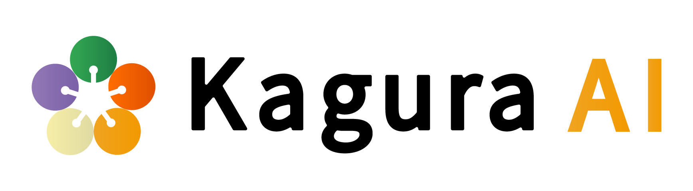

<p align="center">
  
</p>

# kagura-brain

`kagura-brain` is the provider-neutral Python launcher for the CLI coding agents
used as brains by Kagura harnesses. It gives consumers one tested seam for
running Claude Code (`claude -p`) or Codex CLI (`codex exec`), keeping provider
credentials, subprocess behavior, MCP wiring, and verdict handling out of each
harness.

```python
from kagura_brain import select

brain = select("claude")  # or "codex"
result = brain.invoke("Reply with exactly: PONG")

if not result.ok:
    raise RuntimeError(result.detail())

print(result.stdout)
```

## What it provides

- **Two CLI adapters:** Claude Code and Codex share one subprocess, timeout,
  output, and result contract.
- **Subscription-auth hygiene:** inherited provider credentials and endpoint
  overrides are removed before launch so the CLI's own login wins.
- **Explicit alternate backends:** callers can opt into a compatible gateway;
  Codex can also select local Ollama or LM Studio backends.
- **Provider-neutral selection:** `select()` keeps backend dispatch and MCP
  translation inside the library.
- **Safe gate semantics:** the verdict module normalizes proceed/halt decisions;
  unknown or missing verdicts halt.
- **Preflight primitives:** lightweight checks cover binaries, auth commands,
  endpoints, and aggregate reports.

## Backend summary

| | Claude Code | Codex CLI |
|---|---|---|
| Command | `claude -p` | `codex exec` |
| Default auth | Claude subscription login | `codex login` / ChatGPT subscription |
| Scrubbed child environment | `ANTHROPIC_*`, `CLAUDE_*` | `OPENAI_*`, `CODEX_*` |
| MCP | `.mcp.json` via per-call CLI flags | `.mcp.json` translated to per-call `mcp_servers.*` overrides |
| Confinement | permission mode or explicit bypass | sandbox mode or explicit approval+sandbox bypass |
| Alternate backend | Anthropic-compatible gateway | Responses-compatible gateway, Ollama, or LM Studio |

Neither adapter loosens permissions by default. Full-bypass options are explicit,
and the Codex bypass also disables its sandbox. See
[Provider configuration](docs/providers.md) before using an unattended mode.

## Install

```bash
pip install kagura-brain
# or
uv add kagura-brain
```

Requirements:

- Python 3.11+
- `claude` and/or `codex` installed and available on `PATH`
- the selected CLI signed in, unless an explicit alternate backend is used

The Python package is stdlib-only at runtime and deliberately has no dependency
on `kagura-memory`.

For setup, authentication, result handling, and first examples, read
[Getting started](docs/getting-started.md).

## Architecture at a glance

Kagura's reusable harness support is split along two independent axes:

```text
kagura-engineer   kagura-planner   kagura-code-reviewer
        \                |                /
         +---- kagura-brain  +  kagura-memory ----+
               brain axis        memory axis
```

`kagura-brain` launches the coding agent. `kagura-memory` supplies durable
context. Keeping them independent avoids the inverted dependency "memory spawns
the agent". The full module and launch-flow description is in
[Architecture](docs/architecture.md).

## Documentation

| Document | Purpose |
|---|---|
| [Documentation index](docs/README.md) | Map of the available guides and references |
| [Getting started](docs/getting-started.md) | Installation, authentication, first invocation, and results |
| [Provider configuration](docs/providers.md) | Claude/Codex options, MCP behavior, gateways, and permission boundaries |
| [Architecture](docs/architecture.md) | Package boundaries, launch pipeline, modules, and security invariants |
| [Exit-code contract](docs/exit-code-contract.md) | Canonical gate vocabulary and reviewer seam |
| [Contributing](CONTRIBUTING.md) | Development workflow, quality gates, and release smoke tests |
| [Changelog](CHANGELOG.md) | Release history |

## Current release

Version `0.6.0` supports Python 3.11-3.13. The Codex adapter's environment and
configuration assumptions were last audited against Codex CLI `0.145.0`; the
subprocess suite remains mocked, so releases also require the documented real-CLI
smoke test.

## Development

```bash
uv sync --extra dev
uv run ruff check src/ tests/
uv run ruff format --check src/ tests/
uv run mypy
uv run pytest tests/ -v
```

Coverage must remain at or above 90%. See [CONTRIBUTING.md](CONTRIBUTING.md) for
the complete workflow.

## License

Apache-2.0. See [LICENSE](LICENSE) and [NOTICE](NOTICE).
